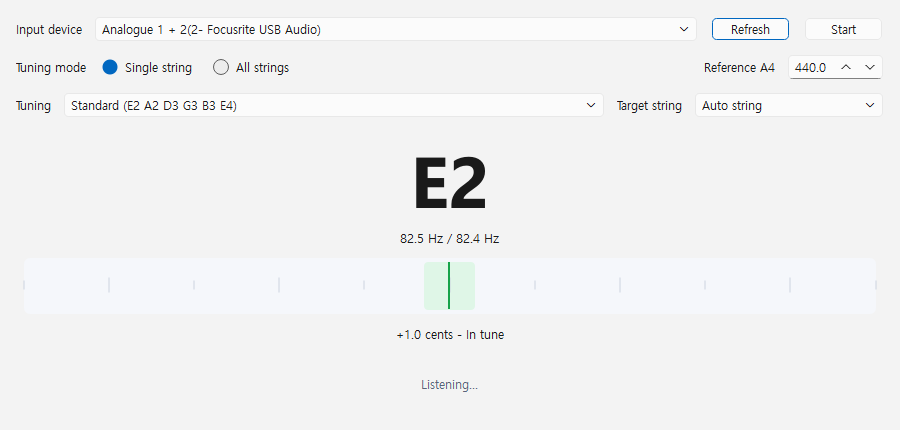
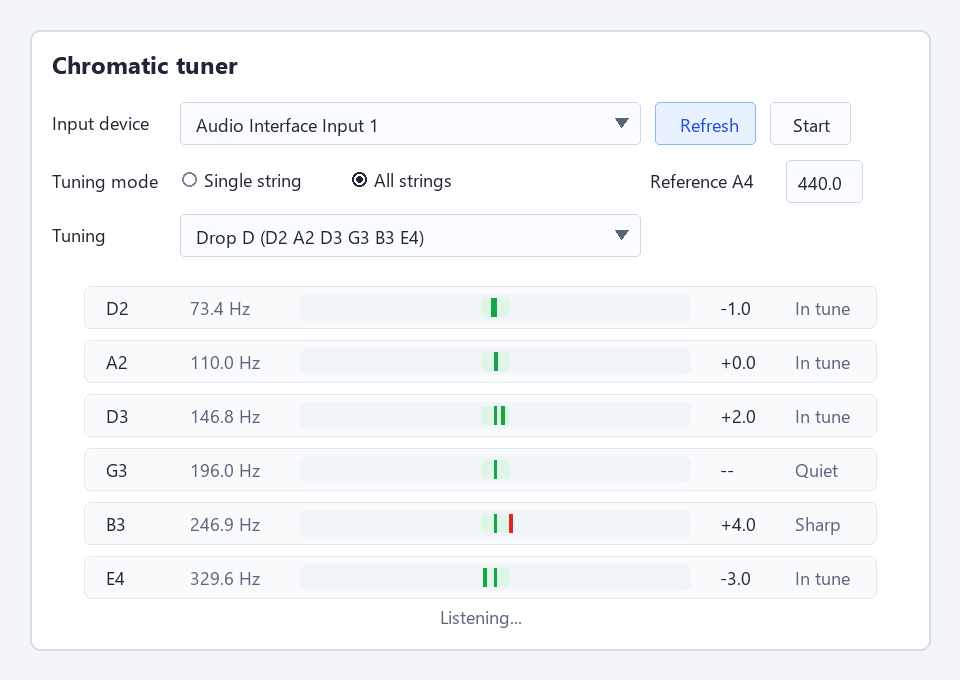
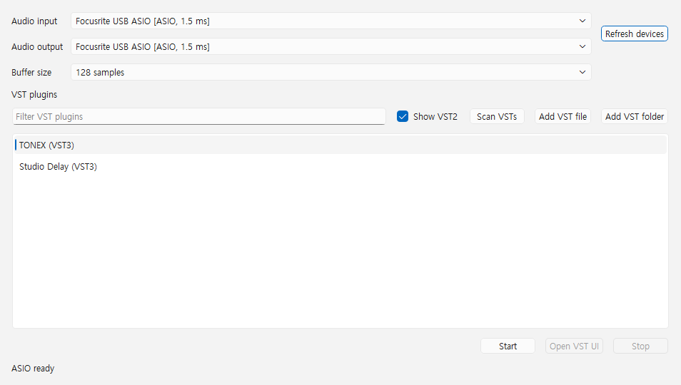

# Tab Analyzer

PyQt6 desktop app for reading Guitar Pro files and estimating scale/chord candidates per measure.

## Screenshots


## Run

```powershell
python -m pip install -r requirements.txt
python main.py
```

Pass a Guitar Pro file path to load a song:

```powershell
python main.py path\to\song.gp5
python main.py path\to\song.gp
```

Songsterr/Guitar Pro 8 style `.gp` files are read from their embedded `Content/score.gpif` data.

## Text summary

```powershell
python main.py path\to\song.gp5 --summary --max-measures 20
```

## Harmony explanation data

The lower explanation pane uses local theory data from `data/harmony_knowledge.json`.
It summarizes public harmony references and connects the selected measure/segment to scale color, chord function, Roman numerals, and progression tendencies.

The right explanation pane summarizes the whole song: estimated tonal center, repeated chord patterns, harmonic rhythm, root movement, and whether 8-bar regions sound harmonically open or closed.

## Tab player

The main score area has a `Tab player` tab. It shows Guitar Pro-style tablature measures and adds MIDI playback controls:

## Chromatic tuner




The `Chromatic tuner` command opens a separate tuner window. Select an audio input device, then press `Start` to monitor the signal. The tuner supports single-string and polyphonic guitar tuning modes, reference A4 adjustment, target string selection, and the built-in tuning presets.

## VST Effect Rack



The `VST Effect Rack` command routes a selected audio input through a VST effect and sends the processed signal to the selected output. The rack scans common VST folders automatically and shows a progress dialog while searching; use `Add VST file` or `Add VST folder` if a plugin is installed elsewhere.

For low-latency monitoring on Windows, the rack enables `sounddevice` ASIO support before loading audio devices. Choose an ASIO input/output pair such as `Focusrite USB ASIO` when available, then set the buffer size to `64`, `128`, `256`, or `512` samples. Smaller buffers reduce latency but can click or drop out on heavier plugins.

VST3 effects are hosted with `pedalboard` when the plugin UI is available, so plugins such as TONEX can open their native editor. If `pedalboard` cannot load a VST3 effect, the rack falls back to `minihost` for headless processing. VST2 files are listed for visibility, but realtime routing currently requires a VST3 effect.

## Tests

```powershell
python -m unittest discover
```
