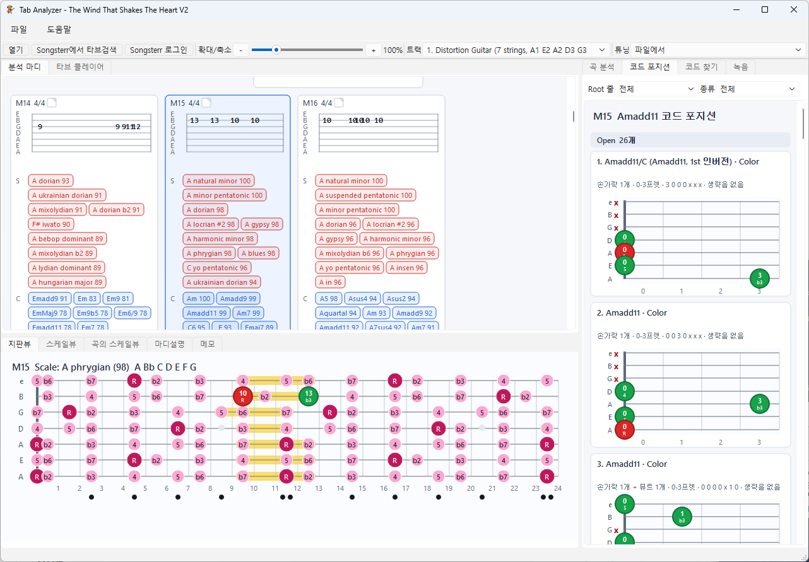
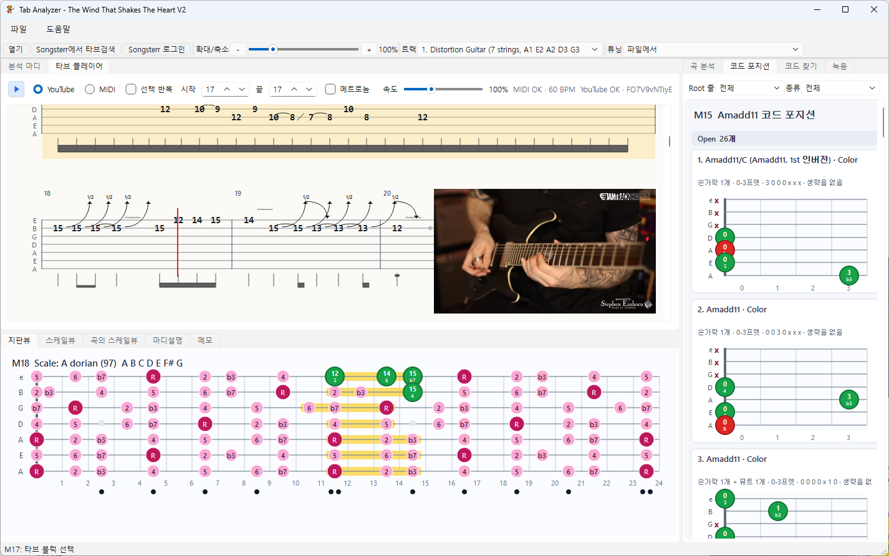

# Tab Analyzer

PyQt6 desktop app for reading Guitar Pro files and estimating scale/chord candidates per measure.

Current version: `0.2`.

## Screenshots



## Run

```powershell
python -m pip install -r requirements.txt
python main.py
```

Pass a Guitar Pro file path to load a song:

```powershell
python main.py path\to\song.gp5
python main.py path\to\song.gp
```

Songsterr/Guitar Pro 8 style `.gp` files are read from their embedded `Content/score.gpif` data.

When a file contains multiple tracks, the toolbar `Track` selector defaults to the first detected electric guitar track. You can switch tracks after loading, and the analysis recalculates for the selected track.

## Text summary

```powershell
python main.py path\to\song.gp5 --summary --max-measures 20
```

## Harmony explanation data

The lower explanation pane uses local theory data from `data/harmony_knowledge.json`.
It summarizes public harmony references and connects the selected measure/segment to scale color, chord function, Roman numerals, and progression tendencies.

The right explanation pane summarizes the whole song: estimated tonal center, repeated chord patterns, harmonic rhythm, root movement, and whether 8-bar regions sound harmonically open or closed.

## Tab player

The main score area has a `Tab player` tab. It shows Guitar Pro-style tablature measures and adds MIDI playback controls:

- select a measure, or Shift-click another measure to select a range
- enable `Repeat selection` to loop the selected measure range
- change playback speed from 50% to 200%
- enable `Metronome` to play a MIDI click that follows the playback speed
- use the tab zoom slider to enlarge or shrink the tablature view
- use the right-side `Recording` tab for recording, recording playback, practice metronome controls, and recorded WAV history

Selecting a tab block updates the lower `Measure notes` tab with how to play the selected frets, strings, rhythm, and detected techniques. The tab-reading explanations are backed by `data/tab_reading_knowledge.json`, which summarizes public tab-notation references.

## Measure memos

Measure memos are saved as `.mmdx` packages. An `.mmdx` file is a ZIP archive with one Markdown file per measure, such as `M1.md` or `M25.md`, so headings like `## M26` inside a memo remain normal memo content. Local images referenced from Markdown are copied into the package on save.

## Tuning presets

The app reads the tuning stored in the Guitar Pro file by default. The toolbar also includes 10 common six-string tuning presets that can override the file tuning and recalculate the whole analysis:

Standard, Drop D, Half-Step Down, D Standard, Drop C, DADGAD, Open G, Open D, Open E, and Open C.

## Tests

```powershell
python -m unittest discover
```
